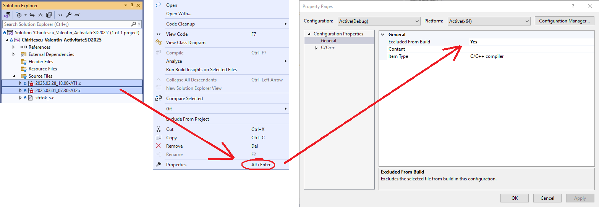
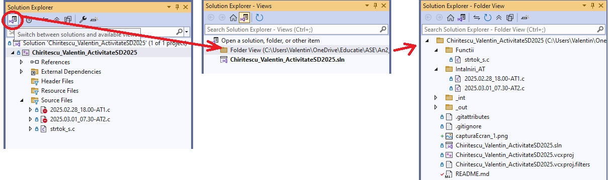

# Activitate SD - ID 2025

Activitate Structuri de Date - Chiritescu Valentin, an 2 ID, grupa 1113  
*Un singur proiect VS - un singur fisier c activ cu funtia main()*

## Proiect Visual Studio Community 2022

### Compilare

Pentru compilarea unui singur fisier c, celelalte fisiere cu cod sursa pot fi excluse de la compilare in **Solution Explorer** astfel:

Selectare fisier/e -> Click dreapta - Properties (ALT+Enter) -> Excluded from Built -> Yes

### Organizare fisiere

Vizualizarea tuturor fisierelor, organizarea lor in dosare, crearea de noi dosare, fisiere text, etc. se poate face rapid din **Folder View**:

Click pe Switch between solutions and available views -> Folder View

